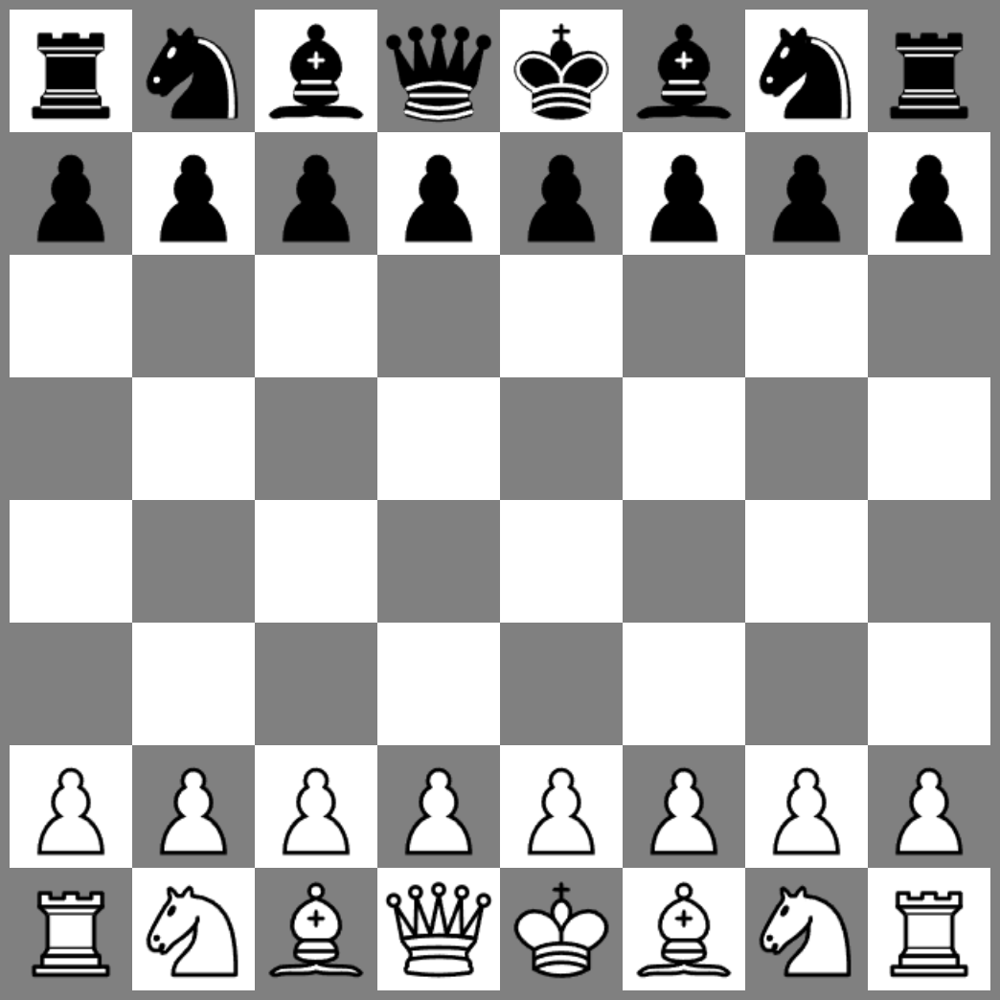
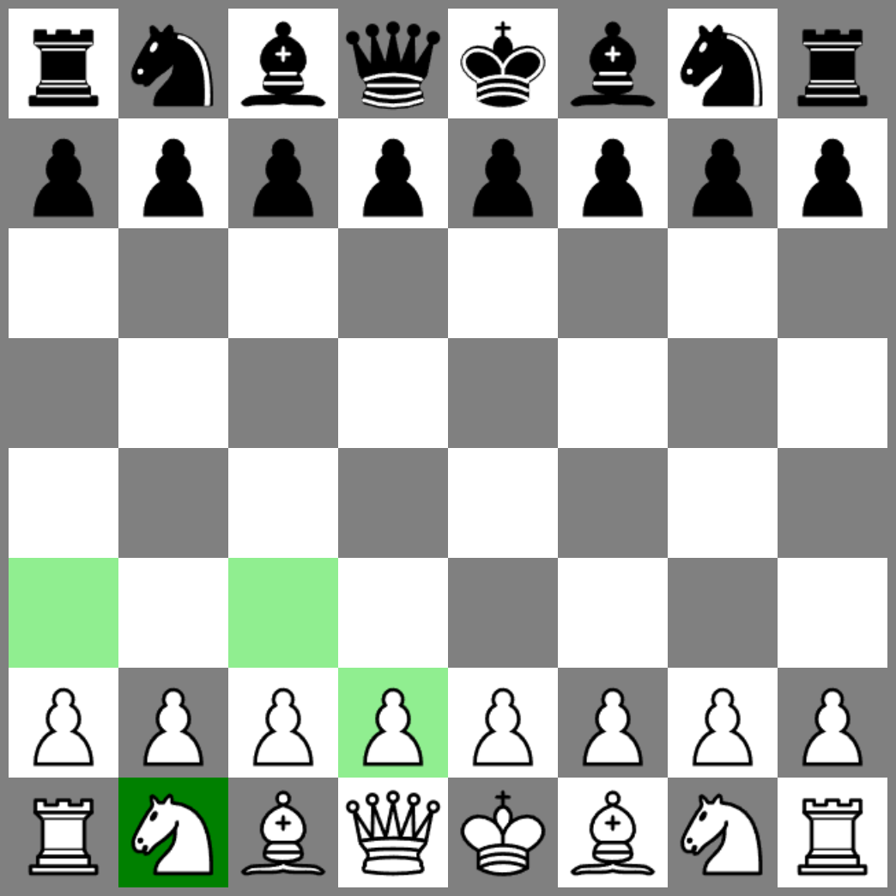

# Chess

**[▶ Play it](https://dimitriuses.github.io/chess/)**


A chessboard written in **one class session on 15 July 2019** — somewhere between 45 and 90
minutes — and never picked up again outside that class. One `main.js` of about a thousand lines,
jQuery for the DOM, twelve PNGs, and no build step of any kind. Every piece's moves are
generated by hand: no chess library, no borrowed engine. It is kept here as an archive of that
session rather than as a working game.

**Controls:** click a piece — its destination squares turn light green — then click one of them
to move. There is no menu, no reset and no turn order: click any piece of either colour at any
time.



## Status: it runs, but it is not a chess game

Verified on Chromium 151 by serving the exact file tree the demo publishes over HTTP — from a
`/chess/` sub-path, as GitHub Pages does — and playing `1.e4 e5 2.Nf3` through the UI:

| | |
|---|---|
| Loads and renders in a current browser | **Yes** — 64 squares, 32 pieces, clean console |
| Pieces move, all six types | **Yes** |
| Blocking (pieces stop at other pieces) | Partly — works along ranks, files and diagonals; not for knights |
| **Captures** | **No. Nothing can ever be taken, by either side** |
| Turn order | Not implemented — four consecutive white moves were played to check |
| Check, checkmate, stalemate, draw | Not implemented |
| Castling, en passant, promotion | Not implemented |
| Moving the white king | **Throws `TypeError`** (the black king is fine) |

So it is a board that enforces *some* of how the pieces slide, and none of what makes chess a
game. The history is one commit — `first commit`, 15 July 2019 — because there was only ever one
sitting: a single class, and no work on it outside class for the rest of the course.

## What was changed in 2026

The code was **tidied, not fixed**. Every defect described below is still present and still
reproducible on the live demo; the original is at the `v0.1-original` tag.

| Change | Why |
|---|---|
| Deleted 179 lines of commented-out code from `main.js` (1,258 → 1,079) | It was dead: earlier drafts of the move filter, abandoned `background-image` experiments, an unused `DestroyPoints` loop |
| Deleted the never-called `sleep()` busy-wait | See *the animation* below |
| Deleted the `DangerousPoints` field | Declared on all six piece types, never written to and never read |
| 32 elements shared `id="theImg"` → `class="piece"` | Duplicate IDs are invalid HTML; the CSS rule now matches by class |
| jQuery 3.4.1 → 3.7.1, with an SRI hash | 3.4.1 carries CVE-2020-11022 / CVE-2020-11023 |
| Dropped `<meta http-equiv="X-UA-Compatible" content="IE=edge">` | Internet Explorer is gone; every current browser ignores it |
| Real `<title>` (was `Page Title`) and a favicon | The favicon 404 was the only console error on the page |
| **Replaced all twelve piece images** | The originals were downloaded in 2019 from a source that was never recorded, and they are not identifiable — see *Licence*. They are now the Cburnett set from Wikimedia Commons, rasterised to the same 80×80, under a licence that can be named. |

**No behaviour was changed by the tidy, and that was checked rather than assumed.** A fingerprint
of the running page — every piece's position and full move list for both sides, plus the computed
background colour, image source and rendered box of all 64 squares, sampled at four points in a
scripted six-click session — is byte-for-byte identical before and after (48,754 characters), and
the three screenshots taken either side of it are identical PNG files.

The piece artwork is the one deliberate exception: the board **looks** different from 2019,
because those images had to go. Everything the code does is unchanged. The original PNGs are
still in the `v0.1-original` tag if you want to see what it looked like.

## Retrospective: what 2019 got wrong

Everything below was reproduced, not inferred — by loading `main.js` into a Node VM with a stub
jQuery, and by driving the real page in headless Chromium. It is a long list for a thousand
lines, and the reason is in the opening paragraph: one class period, no second pass, and nothing
ever tested.

### One line of copy-paste

`Board.GoFigure` handles a move by switching on the piece type. It does that twice: once for
white, once for black, as two 52-statement blocks. Diffing them after swapping `TeamsW` for
`TeamsD` shows **the two copies differ on exactly one line out of 52** — and that line is the
bug:

```js
// white                                          // black
this.TeamsW.GroupKing.GoTo(id);                   this.TeamsD.GroupKing.GoTo(id);
this.TeamsW.EditPointFigure(figure,               this.TeamsD.EditPointFigure(figure,
    this.GroupKing.Location);                         this.TeamsD.GroupKing.Location);
//  ^^^^ missing TeamsW
```

`Board` has no `GroupKing` of its own, so the first white king move throws
`TypeError: Cannot read properties of undefined (reading 'Location')`. The black king, whose
copy of the block is correct, moves fine. Nothing else differs: `FilterGoPoints` is duplicated
the same way, 81 statements per colour, and there the substitution came out clean — 0 lines
differ. One block of 52 got it wrong once, and that is the whole defect.

### Nothing can ever be captured

`IsDestroyed` is initialised to `false` on all six piece types and tested in eleven places, but
**no line anywhere in the file ever sets it to `true`**. The capture feature was designed and
never wired up: every piece also computes a `DestroyPoints` list — for pawns, the two forward
diagonals, the only squares where a pawn's captures differ from its moves — and *nothing in the
program ever reads it*.

The user interface hides this. Driving the model directly, a white pawn will happily walk onto
the black pawn on e7; both pieces then occupy e7, and the next redraw hits the author's own
guard:

```
alert("4 6: Error Draw Figure (types: 1 , 1 )")
```

Clicking cannot reach that state, though — for an unrelated reason. Every square holds an
``, and a piece's image carries its own "select me" handler. Clicking an occupied
destination therefore fires *that piece's* handler first, which calls `DrawBoard()` →
`$("#board").empty()`, and jQuery's `empty()` strips the event handlers off everything it
removes — including the move handler that was sitting on the destination square, mid-event.
Tracing the handlers makes the asymmetry plain:

```
e2 -> e4 (empty square)    : DrawGoPoints(52), GoFigure(52,1)     move happens
e6 -> e7 (black pawn there): DrawGoPoints(20), DrawGoPoints(12)   the enemy piece is selected instead
```

So the board offers you the capture in light green, and then quietly re-selects the piece you
were trying to take.

### The move animation never ran

```js
arr.eq(id).children("img").animate({ ... }, '2000');
...
DrawBoard();          // empties #board
DrawFigure();         // rebuilds all 64 squares
```

Two independent reasons it can't work. The element being animated is destroyed by the redraw on
the next line: measured, it survives **0 ms**. And the duration is the string `'2000'`, which
jQuery does not recognise as a number or as a named speed, so it silently falls back to its
400 ms default — the intended two seconds was never in effect either. The original file also
contains the attempted fix, a `sleep()` that busy-waits on `new Date()`, with its call site
commented out. It could not have worked: a busy-wait blocks the single thread that would have
had to draw the frames. The move had to be deferred instead — `animate()` takes a completion
callback as its next argument, and that argument is where `DrawBoard(); DrawFigure();` belonged.

### Three smaller ones, all measured

| | |
|---|---|
| **Rooks and queens lose two squares each** | `if (i != this.Location.X && i != this.Location.Y)` was meant to skip the piece's own square, but mixes the two axes. A rook on `d1` generates 12 squares instead of 14 — it cannot reach `d4` or `a1`. The defect disappears wherever X and Y happen to be equal, which is why it survived: of the four rooks on the board, the ones on `a1` and `h8` are correct, and the ones on `h1` and `a8` both quietly lose `a1` and `h8`. |
| **Knights ignore blocking entirely** | The blocking filter walks outward along the eight rank/file/diagonal rays, and a knight's move never lands on one. So no knight move is ever filtered: from the opening position the b1 knight offers `a3`, `c3` **and `d2`, where its own pawn is standing.** One click on the live demo shows it — the light green square under the white pawn in the screenshot below. |
| **Move lists go stale for one turn** | Only the side that just moved rebuilds its move lists, and the filter can subtract squares but never adds them back. A square that white vacates stays unavailable to black until black has played some other move. |



### Shape

The file has no modules, no classes and no shared base type: `GoTo`, `IsGoPoint` and
`FindGoPoint` are copy-pasted into all six piece constructors, and the white and black branches
of the two largest functions are duplicated in full — 81 statements per colour in
`FilterGoPoints`, 52 in `GoFigure`. That duplication is not a style complaint; it is where the
king bug came from,
and one shared code path parameterised by colour would have made it impossible.

## Running it locally

No build, no install, no Node. Any static file server works — `file://` does not, because the
piece images are loaded relatively:

```sh
npx http-server -p 8080 .
# then open http://localhost:8080
```

The only dependency is jQuery 3.7.1 from `code.jquery.com`; with no network the page renders
blank.

## Layout

```
index.html                  17 lines - a <div id="board"> and two <script> tags
main.css                    13 lines - the board box and the 64px piece size
main.js                  1,079 lines - pieces, teams, board, move filter, rendering, clicks
img/                     12 PNGs     - the pieces
.github/workflows/pages.yml           - publishes the demo
docs/                                 - the screenshots above
```

`main.js` is one flat file in six parts: six piece constructors (`Pawn` … `King`, each with its
own move generator), `ChessTeam` (the sixteen pieces of one colour), `Board` (both teams, the
blocking filter, and the 64-square render list), and then the jQuery drawing and click handlers.

## Known limitations

- **It is not playable as chess.** No captures, no turn order, no check, no castling, no
  promotion. See the status table above.
- **Moving the white king throws** and does nothing; the board is left as it was.
- **Illegal moves are offered** — knights onto their own pieces, pawns forward onto enemy
  pieces, rooks and queens missing two legal squares each.
- **No tests, and none were added.** This is an archive at "tidy" level, not a rebuild.
- **Fixed 512 px board**; on a 390 px-wide phone the page scrolls sideways. No responsive
  layout, no touch handling beyond what the browser synthesises from a tap.
- **Depends on a CDN.** No jQuery, no page.
- **No accessibility work at all** — the board is 64 `<div>`s and 64 ``s with no roles, no
  labels and no keyboard path.
- **The piece images are not the 2019 ones** — those had no recorded source and were replaced.
  The current set is CC BY-SA 3.0, so it carries an attribution and share-alike obligation the
  MIT code does not; see *Licence*.

## Licence

The **code** is MIT — see [LICENSE](LICENSE).

The **piece images** are by [Cburnett](https://commons.wikimedia.org/wiki/User:Cburnett),
from Wikimedia Commons, licensed **[CC BY-SA 3.0](https://creativecommons.org/licenses/by-sa/3.0/)**
— the same set Wikipedia, lichess and chessboard.js use. They are rasterised here to 80×80 PNGs
from the original SVGs ([`Chess_klt45.svg`](https://commons.wikimedia.org/wiki/File:Chess_klt45.svg)
and its eleven siblings); as derivatives they remain under CC BY-SA 3.0, not MIT. See
[`img/ATTRIBUTION.md`](img/ATTRIBUTION.md) for the per-file source list.

They are not the images this repository shipped in 2019. Those were downloaded from a source
that was never written down, and they turned out not to be identifiable — laid side by side with
the Cburnett set, the knight's mane, the crowns and the pawn's base are all drawn differently, so
there was nobody to credit and no way to find out whom. They were replaced rather than left as an
open question. Taking art without recording where it came from is its own small lesson from 2019,
and this is what fixing it looks like.
